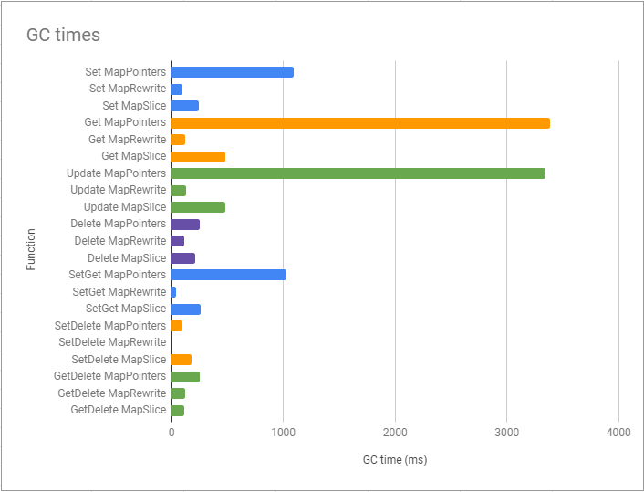

# Speed and GC time benchmarks for Go native map variations
For maps containing:

- Pointers `map[int32]*Item`
- Map with struct values `map[int32]Item`, updating map values by reading from the map and then writing back
- Map `map[int32]int` backed with slice `[]*Item` and set `map[int32]struct{}`. Map contains slice indexes as values, slice contains pointers to a struct, and the set contains free (previously deleted) slice indexes (for re-use).

## Benchmarks

|Benchmark|Iterations|ns/op|Bytes/op|allocs/op|
|---------|----------|-------|--------|---------|
|Pointers_Set-8|50000000 |278 |37 B/op|1 |
|Rewrite_Set-8|100000000|454 |51 B/op|1 |
|Slice_Set-8|50000000 |263 |48 B/op|1 |
|Pointers_Get-8|100000000|143 |0 B/op|0 |
|Rewrite_Get-8|100000000|344 |16 B/op|1 |
|Slice_Get-8|100000000|159 |0 B/op|0 |
|Pointers_Update-8|100000000|235 |0 B/op|0 |
|Rewrite_Update-8|100000000|298 |0 B/op|0 |
|Slice_Update-8|100000000|250 |0 B/op|0 |
|Pointers_Delete-8|100000000|203 |0 B/op|0 |
|Rewrite_Delete-8|100000000|204 |0 B/op|0 |
|Slice_Delete-8|30000000 |624 |46 B/op|0 |
|Pointers_SetGet-8|50000000 |267 |37 B/op|1 |
|Rewrite_SetGet-8|50000000 |317 |67 B/op|2 |
|Slice_SetGet-8|50000000 |269 |48 B/op|1 |
|Pointers_SetDelete-8|100000000|275 |35 B/op|1 |
|Rewrite_SetDelete-8|100000000|327 |47 B/op|1 |
|Slice_SetDelete-8|50000000 |469 |46 B/op|1 |
|Pointers_GetDelete-8|100000000|248 |0 B/op|0 |
|Rewrite_GetDelete-8|100000000|330 |16 B/op|1 |
|Slice_GetDelete-8|30000000 |623 |46 B/op|0 |

## GC times

|Function|GC time (ms)|
|--------|------------|
|Set MapPointers |1092.5|
|Set MapRewrite |101.0|
|Set MapSlice |242.9|
|Get MapPointers |3387.0|
|Get MapRewrite |120.9|
|Get MapSlice |478.9|
|Update MapPointers |3346.3|
|Update MapRewrite |127.9|
|Update MapSlice |482.8|
|Delete MapPointers |254.8|
|Delete MapRewrite |113.6|
|Delete MapSlice |211.7|
|SetGet MapPointers |1029.8|
|SetGet MapRewrite |41.8|
|SetGet MapSlice |263.8|
|SetDelete MapPointers |100.0|
|SetDelete MapRewrite |0.4|
|SetDelete MapSlice |179.2|
|GetDelete MapPointers |248.7|
|GetDelete MapRewrite |119.8|
|GetDelete MapSlice |111.3|

## Summary
Overall, maps with pointers are fast, but GC times are really terrible, taking 4-7x times more than the map backed with a slice of pointers.

The map with structs is the slowest on all operations except for delete, where it 3x times faster than the map backed with a slice. Nevertheless, it has the shortest GC times on all operations.

The map with a backed slice of pointers takes really long time to delete an element, since it is performing 3 operations: deleting from the map itself, removing the reference from the slice and adding the element's index to the set of "free" indexes to be reused later. However, GC times are 3x-7x shorter compared to the map with pointer values.

For a huge map with frequent delete operations I'd recommend to use the map with struct values which rewrites updated values back to the map.

Otherwise it is better to use the map backed with a slice of pointers.

